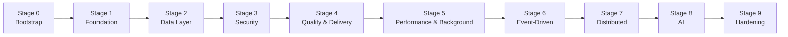
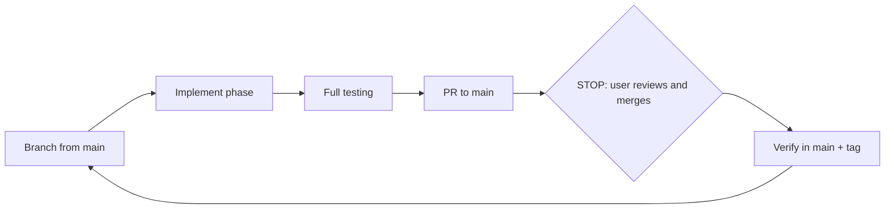

# EcomDemo: Learning Roadmap (v4, split edition)

From a simple Spring Boot monolith to a production-grade distributed system, **one technology per phase**, built by Claude Code with the user as tech lead and learner.

> **Claude Code:** don't read this file in full. Edit only the tracker row of the current or previous phase. Everything you need is in `CLAUDE.md` and the files it points to.

## Start here (user)

1. Read `docs/process/your-role.md`.
2. Complete the setup checklist there.
3. Paste the kickoff prompt from `docs/process/kickoff-and-commands.md` into Claude Code.

## Package map

```
ecomdemo/
├── CLAUDE.md                          # auto-loaded rules + pointers (Claude Code entry point)
└── docs/
    ├── ROADMAP.md                     # this file: overview + progress tracker
    ├── decisions.md                   # long-lived decision log
    ├── process/
    │   ├── execution-protocol.md      # lifecycle, commands, stop points, resume sequence
    │   ├── git-workflow.md            # mandatory Git rules + commands + verification
    │   ├── testing-protocol.md        # testing & acceptance, every phase
    │   ├── context-management.md      # what to load, checkpoint and summary rules
    │   ├── your-role.md               # the user's responsibilities
    │   └── kickoff-and-commands.md    # kickoff prompt + command vocabulary
    ├── phases/
    │   └── phase-00-… phase-31-….md   # one file per phase (only the current one is read)
    ├── progress/
    │   ├── CURRENT.md                 # in-phase checkpoint (resume point)
    │   ├── RECENT.md                  # rolling summaries of the last 2 phases
    │   └── archive/                   # older summaries (not loaded)
    ├── test-reports/                  # phase-XX.md test reports
    └── architecture/
        └── target-architecture.md     # final architecture diagram (reference)
```

## The journey at a glance



## The phase cycle



## Progress tracker

Status: ⬜ Not started · 🟡 In progress · 🔵 PR open · ✅ Done (verified in `main`, tagged)

| # | Phase | Technology | Branch | Status |
|---|---|---|---|---|
| 0 | [Repository Bootstrap](phases/phase-00-bootstrap.md) | Git + GitHub + GitHub CLI | `main` | ✅ |
| 1 | [Baseline Monolith](phases/phase-01-baseline-monolith.md) | Spring Boot + H2 | `feature/phase-01-baseline-monolith` | ✅ |
| 2 | [Automated Testing](phases/phase-02-testing.md) | JUnit 5 + Mockito + MockMvc | `feature/phase-02-testing` | ✅ |
| 3 | [API Documentation](phases/phase-03-openapi.md) | springdoc-openapi | `feature/phase-03-openapi` | ✅ |
| 4 | [PostgreSQL](phases/phase-04-postgresql.md) | PostgreSQL | `feature/phase-04-postgresql` | 🔵 |
| 5 | [Database Migrations](phases/phase-05-flyway.md) | Flyway | `feature/phase-05-flyway` | ⬜ |
| 6 | [Transactions & Concurrency](phases/phase-06-transactions.md) | @Transactional + optimistic locking | `feature/phase-06-transactions` | ⬜ |
| 7 | [Integration Testing](phases/phase-07-testcontainers.md) | Testcontainers | `feature/phase-07-testcontainers` | ⬜ |
| 8 | [Spring Security](phases/phase-08-spring-security.md) | Spring Security | `feature/phase-08-spring-security` | ⬜ |
| 9 | [JWT Authentication](phases/phase-09-jwt.md) | JWT (OAuth2 Resource Server) | `feature/phase-09-jwt` | ⬜ |
| 10 | [Containerization](phases/phase-10-docker.md) | Docker + Docker Compose | `feature/phase-10-docker` | ⬜ |
| 11 | [Continuous Integration](phases/phase-11-github-actions.md) | GitHub Actions | `feature/phase-11-github-actions` | ⬜ |
| 12 | [Code Quality](phases/phase-12-sonarqube.md) | SonarQube + JaCoCo | `feature/phase-12-sonarqube` | ⬜ |
| 13 | [Caching](phases/phase-13-redis.md) | Redis | `feature/phase-13-redis` | ⬜ |
| 14 | [Batch Processing](phases/phase-14-spring-batch.md) | Spring Batch | `feature/phase-14-spring-batch` | ⬜ |
| 15 | [Metrics & Monitoring](phases/phase-15-metrics.md) | Actuator + Prometheus + Grafana | `feature/phase-15-metrics` | ⬜ |
| 16 | [Centralized Logging](phases/phase-16-logging.md) | Grafana Loki | `feature/phase-16-logging` | ⬜ |
| 17 | [Messaging](phases/phase-17-kafka.md) | Apache Kafka | `feature/phase-17-kafka` | ⬜ |
| 18 | [Reliable Event Publishing](phases/phase-18-outbox.md) | Transactional Outbox | `feature/phase-18-outbox` | ⬜ |
| 19 | [Modular Monolith](phases/phase-19-modulith.md) | Spring Modulith | `feature/phase-19-modulith` | ⬜ |
| 20 | [Microservices Split](phases/phase-20-microservices.md) | Multi-service architecture | `feature/phase-20-microservices` | ⬜ |
| 21 | [API Gateway](phases/phase-21-gateway.md) | Spring Cloud Gateway | `feature/phase-21-gateway` | ⬜ |
| 22 | [Resilience](phases/phase-22-resilience.md) | Resilience4j | `feature/phase-22-resilience` | ⬜ |
| 23 | [Distributed Tracing](phases/phase-23-tracing.md) | OpenTelemetry + Tempo | `feature/phase-23-tracing` | ⬜ |
| 24 | [Distributed Transactions](phases/phase-24-saga.md) | Saga pattern | `feature/phase-24-saga` | ⬜ |
| 25 | [Container Orchestration](phases/phase-25-kubernetes.md) | Kubernetes (kind/minikube) | `feature/phase-25-kubernetes` | ⬜ |
| 26 | [Cloud Deployment (Optional)](phases/phase-26-aks.md) | Azure AKS + ACR | `feature/phase-26-aks` | ⬜ |
| 27 | [LLM Integration](phases/phase-27-spring-ai.md) | Spring AI | `feature/phase-27-spring-ai` | ⬜ |
| 28 | [Semantic Search](phases/phase-28-semantic-search.md) | pgvector | `feature/phase-28-semantic-search` | ⬜ |
| 29 | [AI Shopping Assistant](phases/phase-29-ai-assistant.md) | RAG + tool calling | `feature/phase-29-ai-assistant` | ⬜ |
| 30 | [Performance Testing](phases/phase-30-gatling.md) | Gatling | `feature/phase-30-gatling` | ⬜ |
| 31 | [Security Scanning](phases/phase-31-security-scanning.md) | OWASP Dependency-Check + Trivy | `feature/phase-31-security-scanning` | ⬜ |
