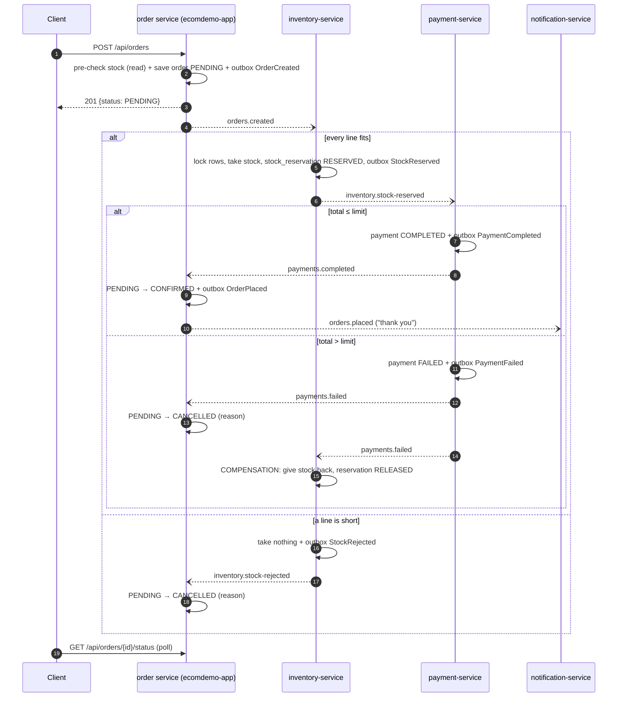
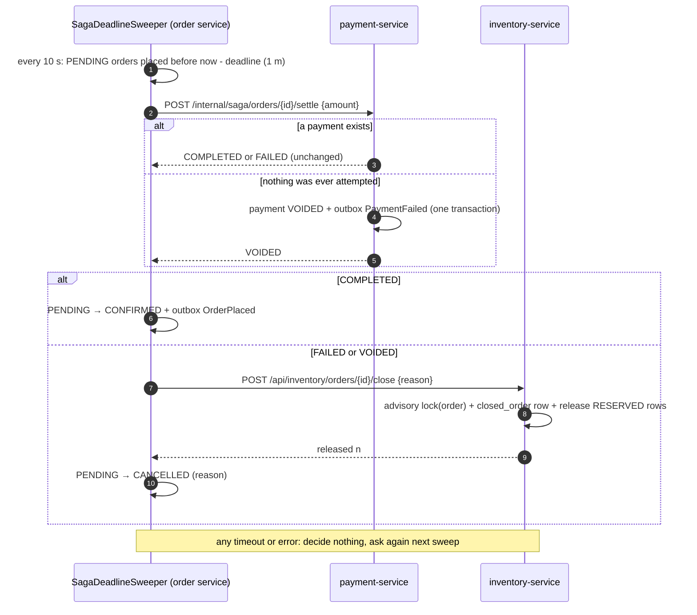

# Distributed transactions: the checkout saga (Phase 24)

Checkout touches three services, each with its own database: the **order service**
(`ecomdemo-app`) creates the order, **inventory-service** holds the stock, and
**payment-service** takes the money. This document explains how they stay consistent without a
distributed transaction. It covers what was built (a **choreographed saga**) and the alternative
that was considered and documented instead (an **orchestrated saga**).

## Why not a distributed transaction (2PC)?

Two-phase commit makes several databases commit together. A coordinator asks every participant
to *prepare* (to promise it can commit) and then tells all of them to *commit*. It is the textbook
answer, and it was avoided for four reasons:

1. **It blocks.** A participant that has prepared holds its locks until the coordinator says
   commit or abort. If the coordinator dies between the two phases, those locks stay held, and the
   stock row for a popular product stays locked with them. Availability becomes the coordinator's
   availability.
2. **It couples the services' uptime.** Every participant must be reachable for any checkout to
   finish. One slow payment provider would stall checkout for everyone.
3. **Kafka is not a useful participant.** Our messages go through Kafka. A 2PC over PostgreSQL
   and Kafka would need XA support that Kafka does not offer, so we would be back to the
   dual-write problem that Phase 18's outbox solved.
4. **It does not scale out.** Locks held across network round trips are the most expensive locks
   there are.

A saga gives up atomicity and keeps consistency. It is a sequence of **local** transactions, one
per service. Each one commits on its own and publishes an event that triggers the next. If a
later step fails, the earlier ones are undone by **compensating transactions**. The system is
briefly inconsistent: an order can be PENDING while its stock is already held. It is guaranteed
to end consistent.

## The saga as built: choreography

Nobody is in charge. Each service reacts to events and publishes its own.

| Step | Service | One local transaction | Publishes |
|---|---|---|---|
| 1 | order | order row (PENDING), cart emptied, outbox row | `orders.created` |
| 2 | inventory | `processed_event`, stock reduced, `stock_reservation` rows, outbox row | `inventory.stock-reserved` or `inventory.stock-rejected` |
| 3 | payment | `processed_event`, `payment` row, outbox row | `payments.completed` or `payments.failed` |
| 4a | order | `processed_event`, PENDING → CONFIRMED, outbox row | `orders.placed` |
| 4b | order | `processed_event`, PENDING → CANCELLED | — |
| C | inventory | `processed_event`, stock returned, reservations RELEASED | — (the compensation) |

Every step follows one pattern, and it is the whole design in one sentence: **claim the event,
change the data, announce the result, all in one local transaction.** Each part guards against
something:

- **Without the claim** (`processed_event`), a redelivered event does the work twice.
- **Without the announcement** (the outbox row), the saga stops dead, with stock held for an
  order nobody will ever confirm.
- **Without both in the same transaction**, one can commit without the other. That is the same
  dual-write problem Phase 18 solved, one level up.

The pieces live in a shared library, the `outbox` Maven module. `Outbox` handles publishing,
`ProcessedEvents` is the idempotent consumer, and `SagaListenerErrors` handles dead-lettering.
All three services use the same code.

### Compensation

Only one thing needs undoing: **the stock inventory reserved**, when payment then fails.
inventory-service does it on its own, because it reads `payments.failed` just as the order service
does. It knows *what* to give back because it recorded each reservation in `stock_reservation`:
the event carries only an order id.

A compensating transaction is **not a rollback**. It is a second business operation that means the
opposite of the first, and it happens later. The stock was really unavailable for a few seconds,
and another shopper may have seen "only 3 left" meanwhile. It is also made idempotent twice over:
by `processed_event`, and by releasing only reservations that are still `RESERVED`. The one step
of a saga that must never happen twice gets two guards.

A stock **rejection** needs no compensation: inventory took nothing. Payment is the last step
that can fail, so nothing after it ever needs undoing. **Ordering the steps so that the step most
likely to fail comes last, and the step that is hardest to undo comes last of all, is a
saga-design skill.** Payment is both.

### Semantic locks

While a saga runs, some data is in a state that others must treat carefully. A saga cannot lock
it the way a database transaction would, so it marks it instead:

- **The order's PENDING status.** Only PENDING can move, only once, and only through
  `OrderRepository.transition`, a conditional `UPDATE … WHERE status = 'PENDING'`. A late or
  duplicate reply finds zero rows to change. The sales report ignores PENDING orders, and
  notification-service is only told about CONFIRMED ones.
- **`stock_reservation` RESERVED rows.** Those units belong to an undecided order. They are not
  sold (the order may be cancelled) and not available to anyone else.

### Eventual consistency, as a client sees it

- `POST /api/orders` answers **201 with status PENDING**. The read-only stock **pre-check** still
  answers an obviously short cart with an immediate 409. It is a courtesy; the reservation is the
  guarantee.
- The client polls `GET /api/orders/{id}/status`. Warm, it takes about three seconds: three
  outbox relays, each polling once a second.
- The catalogue's stock figure changes after the reservation, and after the catalogue's cache
  hears about it.
- The cart is emptied at checkout, so a cancelled order does not refill it. The shopper can
  re-add the items.

### What happens when…

| Failure | Result |
|---|---|
| inventory- or payment-service is down | Orders stay PENDING. Their events wait in Kafka, and the service catches up from its offsets when it returns. No checkout fails. |
| Kafka is down | Checkout still succeeds (Phase 18). Every outbox holds its rows and drains when Kafka is back. |
| A relay publishes twice (crash after the send) | The consumer's `processed_event` absorbs the duplicate. |
| Two shoppers take the last unit | Both usually pass the pre-check. The reservation locks the row and gives it to one; the other is CANCELLED "for stock". |
| A message cannot be processed at all (bad JSON, a bug) | Three attempts in place, then `<topic>-dlt`. Since Phase 32 the **saga deadline** resolves the order (see below), and an administrator can replay the dead letter. |
| A participant is down when the deadline arrives | The order stays PENDING and is asked about again on every sweep: an unknown outcome is never guessed. `SagaOrdersStuck` fires after 10 minutes. |

## The alternative: orchestration

In an **orchestrated** saga, one component, the orchestrator, *tells* each service what to do and
decides what happens next. With this codebase it would look like this:

- An `OrderSagaOrchestrator` in the order service, with a `order_saga` table recording each
  order's current step (`RESERVING_STOCK`, `CHARGING`, `COMPENSATING`, `DONE`).
- **Commands** instead of events, on command topics owned by the receiver: `inventory.reserve`,
  `payment.charge`, `inventory.release`. A command has one intended handler and can be refused;
  an event is a fact that anyone may react to (the difference `KafkaTopics` already explains).
- **Replies** to one reply topic the orchestrator reads, such as `order-saga.replies` carrying
  `StockReserved` or `PaymentFailed`. The orchestrator's state machine picks the next command, for
  example `PaymentFailed → send inventory.release → wait for StockReleased → CANCELLED`.
- inventory-service would stop reading `payments.failed`. It would release stock only when told
  to.

| | Choreography (built) | Orchestration |
|---|---|---|
| Where the flow is written | Spread across three services' listeners | In one class |
| Adding a step (e.g. shipping) | Every neighbour must learn a new event | One change to the orchestrator |
| Coupling | Each service knows the events it reads, not who else exists | Every participant is coupled to the orchestrator's commands |
| Seeing a saga's state | Assemble it from three databases (or one trace, since Phase 23) | One row in `order_saga` |
| Cyclic dependencies | Easy to create by accident as steps grow | Avoided by construction |
| Single point of failure / bottleneck | None | The orchestrator (mitigated by it being just another service with a database) |
| Compensation order | Implicit (each service reacts) | Explicit, in reverse order, in one place |
| Timeouts | Nobody owned them until Phase 32; now the order service's sweeper | The orchestrator's natural job |

**Why choreography here:** three steps, one compensation, and a learning goal of seeing each
service act on its own. That is choreography's sweet spot. Its weaknesses start to bite around
four or five steps, or when a business needs to ask "where is order 4812 stuck?" often. At that
point an orchestrator, hand-written or from a framework such as **Temporal**, **Camunda / Zeebe**,
**Axon** or **Eventuate Tram**, is the better shape. None of them is added here; the phase asked
for the alternative to be *documented*.

## The saga deadline (Phase 32)

Choreography left timeouts with no owner (see the table above). Phase 32 gives them to the **order
service**, because it owns the state being waited on: it created the PENDING order, shows it to the
shopper, and is the only service that can move it. Inventory and payment each see only their own
step and cannot tell "slow" from "lost".

**Reconciliation, not compensation.** Compensation undoes a step that is known to have happened.
Reconciliation first finds out what happened, from the service that owns the answer, and then
brings the order into line with it. A blind "PENDING too long → CANCELLED" would cancel a saga that
succeeded but lost its last message, after the customer had paid.

**Ask and fence.** Each question to a participant also closes the door behind it. Settling an
unpaid order VOIDS it, so it occupies the order's single payment slot (`uq_payment_order`), and a
late or replayed StockReserved is refused by the existing "already has a payment" guard. Closing an
order writes `closed_order`, so a late or replayed OrderCreated is rejected. Without the fence, the
answer "nothing happened" could stop being true a moment after it was given.

**Why payment first.** Payment is the one step that cannot be undone, so its answer decides. Stock
can be released any number of times harmlessly. The order is cancelled only after inventory confirms
the close; cancelling first would take the order out of every later sweep and could leave its stock
held for ever.

**The unknown outcome.** A timeout means "I don't know", not "no". The request may have been carried
out and only the reply lost. The reconciler therefore decides nothing without an answer. The order
stays PENDING, `saga_orders_overdue` shows it, and the next sweep asks again. That is safe because
both questions are idempotent.

**Dead letters.** `GET /api/admin/dead-letters` lists the five saga DLTs (read from the beginning
with an assigned consumer, so nothing is "consumed"). `POST .../{topic}/{partition}/{offset}/replay`
sends a record back to its original topic byte for byte, recorded in `dead_letter_replay`, and only
once per record. Replay is safe because of `processed_event` and the fences above.

**Known limits** (in `docs/KNOWN_ISSUES.md`):
- An order whose **StockRejected** is dead-lettered is cancelled with the void's reason, not the
  stock message: the rejection was never recorded anywhere the reconciler can ask.
- The sweep runs in every application instance. That is safe (the far side is idempotent and the
  decision is a conditional UPDATE) but makes duplicate HTTP calls.

## Not done (follow-ups)

- **Restoring the cart** when an order is cancelled.
- notification-service still has its own copy of the idempotent-consumer code; it could use
  `ProcessedEvents` from the library (KI-010).
- Nothing prunes `processed_event` yet (the index for it exists) (KI-008).
- `InventoryGateway.reserve`/`release` and inventory's matching HTTP endpoints are no longer used
  by checkout. They can go once nothing else is expected to call them (KI-011).
