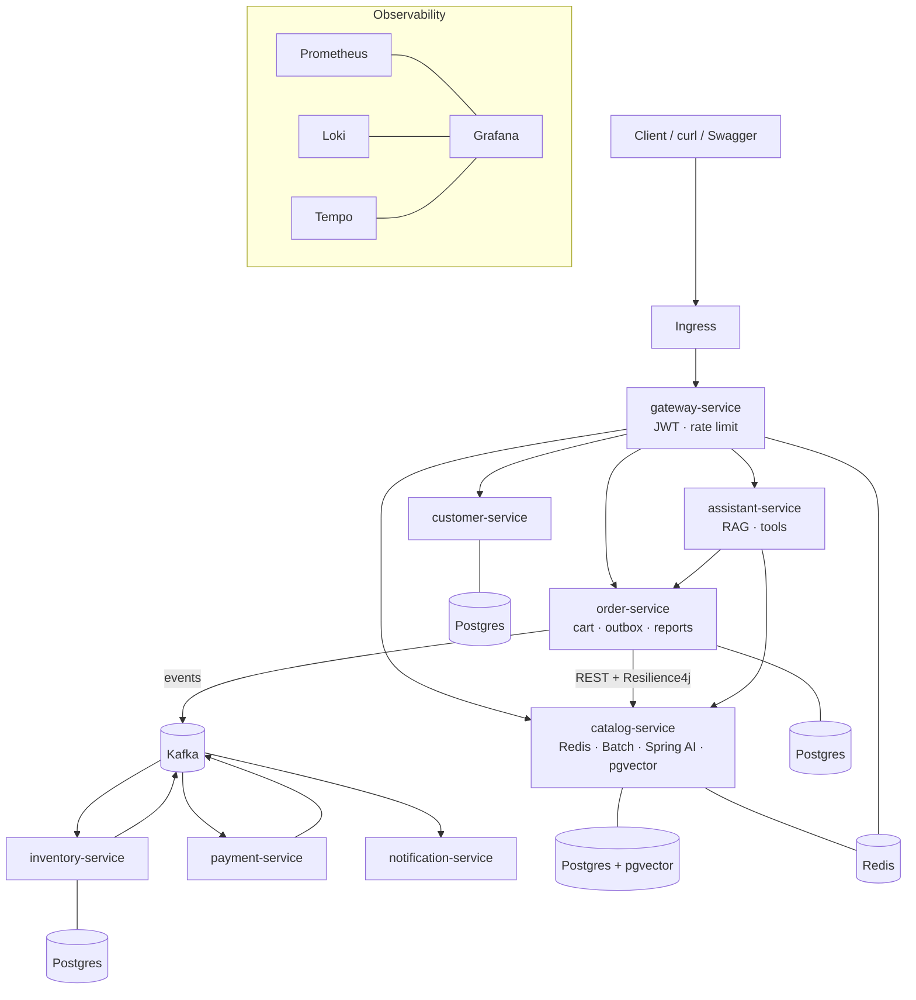

# Target Architecture (after Phase 29)

Reference only. Read this file only when a phase needs the big picture (Phases 19–29).

```mermaid
flowchart TB
    Client[Client / curl / Swagger] --> Ingress
    Ingress --> GW[gateway-service<br/>JWT · rate limit]
    GW --> CUS[customer-service]
    GW --> CAT[catalog-service<br/>Redis · Batch · Spring AI · pgvector]
    GW --> ORD[order-service<br/>cart · outbox · reports]
    GW --> AST[assistant-service<br/>RAG · tools]
    ORD -->|REST + Resilience4j| CAT
    AST --> CAT
    AST --> ORD
    ORD -->|events| K[(Kafka)]
    K --> INV[inventory-service]
    K --> PAY[payment-service]
    K --> NOT[notification-service]
    INV --> K
    PAY --> K
    CUS --- DB1[(Postgres)]
    CAT --- DB2[(Postgres + pgvector)]
    ORD --- DB3[(Postgres)]
    INV --- DB4[(Postgres)]
    CAT --- R[(Redis)]
    GW --- R
    subgraph Observability
      P[Prometheus] --- G[Grafana]
      L[Loki] --- G
      T[Tempo] --- G
    end
```
