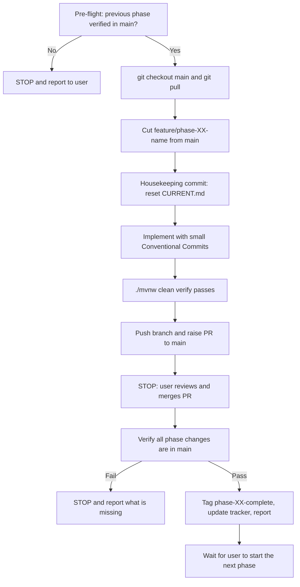

# ⚠️ Mandatory Git Workflow

Applies to every phase, without exception.

These rules are **non-negotiable**. Any AI assistant (Claude Code) or developer working on this project must follow them exactly. If any rule cannot be followed, **STOP and ask the user**. Never work around a rule.

## The Rules

1. **Branch first.** Every phase starts by cutting a **new feature branch from the latest `main`**. All changes for that phase are made **only** on this branch.
2. **Pull Request when done.** When the phase is complete on the feature branch, push it and **raise a Pull Request** targeting `main`.
3. **Gate on `main`.** The next phase may start **only after** the PR is merged **and** every change from the phase is present in `main`.
4. **Repeat for every phase.** Each new phase follows the same cycle: new branch from `main` → changes → PR into `main`.
5. **Verify before moving on.** After the merge, verify that **all** changes from the phase exist in `main` (checklist below). Move to the next phase **only if verification passes**.
6. **Never delete feature branches.** Do not delete branches, local or remote, during or after a merge. They are the permanent history of the learning journey.

## Additional Guardrails

- **Never commit directly to `main`.** The only exception is the initial bootstrap commit in Phase 0.
- **Progress files follow the same rules.** `docs/progress/*`, the tracker, and `docs/decisions.md` are only ever changed on a feature branch.
- **Never force-push** (`--force`, `--force-with-lease`) to any branch.
- **Never merge the PR yourself.** Claude Code raises the PR and **stops**. The user reviews and merges it on GitHub. Claude Code may merge only if the user explicitly says so in chat for that specific PR.
- **Merge method: "Create a merge commit" only.** Do not use squash or rebase merging. A merge commit preserves the branch's commits in `main`, which keeps the verification checks below reliable.
- **Never rebase or rewrite history** on a branch after its PR is opened.
- **One phase = one branch = one PR.** Do not mix work from two phases.
- **Do not start the next phase on your own.** The next phase starts only when the user explicitly says to continue **and** the merge verification of the current phase passes.

## Branch and Naming Conventions

| Item | Convention | Example |
|---|---|---|
| Feature branch | `feature/phase-XX-<short-name>` | `feature/phase-06-transactions` |
| Fix on an open phase | commit to the same feature branch | n/a |
| Commit messages | Conventional Commits | `feat(order): make checkout atomic` |
| PR title | `Phase XX: <Technology>` | `Phase 06: Transactions & Concurrency` |
| Completion tag | `phase-XX-complete` (on `main`, after verification) | `phase-06-complete` |

## The Phase Lifecycle

## Command Reference

**1. Pre-flight (before starting phase XX)**

    git fetch origin --prune
    git checkout main
    git pull origin main
    git status                                   # must be clean
    git tag --list "phase-*"                     # previous phase tag must exist
    gh pr list --state open                      # no open PR from the previous phase

**2. Cut the branch**

    git checkout -b feature/phase-XX-<short-name> main
    git push -u origin feature/phase-XX-<short-name>

**3. Work and commit**

    git add <files>
    git commit -m "feat(<scope>): <message>"
    ./mvnw clean verify
    git push

**4. Raise the Pull Request**

    gh pr create --base main --head feature/phase-XX-<short-name> \
      --title "Phase XX: <Technology>" \
      --body-file .github/pull_request_template.md

Then **STOP** and give the user the PR URL.

**5. Verify after the user has merged**

    git fetch origin --prune
    git checkout main
    git pull origin main
    gh pr view <PR-number> --json state,mergedAt,mergeCommit    # state must be MERGED
    git merge-base --is-ancestor origin/feature/phase-XX-<short-name> origin/main \
      && echo "PASS: all branch commits are in main" || echo "FAIL"
    git log origin/main..origin/feature/phase-XX-<short-name> --oneline   # must print nothing
    git diff origin/main origin/feature/phase-XX-<short-name> --stat      # must print nothing
    git ls-remote --heads origin feature/phase-XX-<short-name>            # branch must still exist
    ./mvnw clean verify                                                   # main must build and pass

**6. Mark the phase complete**

    git tag -a phase-XX-complete -m "Phase XX complete: <Technology>"
    git push origin phase-XX-complete

**Tracker updates never go directly to `main`.** Inside a phase's PR, the phase is marked "🔵 PR open". The **first commit** on the next phase's branch marks the previous phase "✅ Done" (`docs(roadmap): mark phase XX complete`). Git tags and PR states are the source of truth; the tracker is the human-readable mirror.

## Verification Checklist (every phase)

- [ ] PR state is `MERGED`, and it was merged with a merge commit.
- [ ] The feature branch is an ancestor of `main` (`merge-base --is-ancestor` passes).
- [ ] No commits on the feature branch are missing from `main`.
- [ ] No file differences between the feature branch and `main`.
- [ ] Every "What you'll implement" item of the phase is present in `main`.
- [ ] `./mvnw clean verify` passes on `main` (and CI is green once Phase 11 is done).
- [ ] The feature branch still exists locally and on GitHub.
- [ ] Tag `phase-XX-complete` is pushed.
